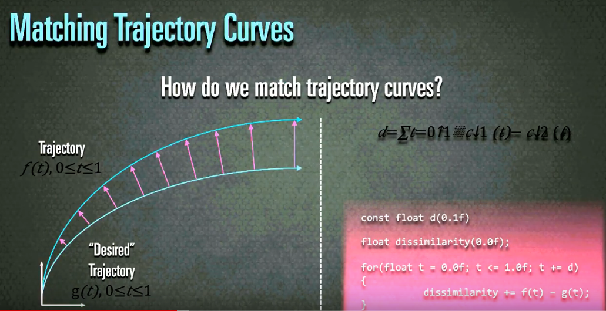
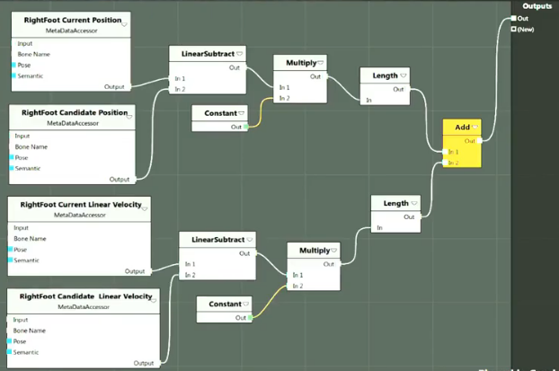

# [Nucl.ai 2015] Motion Matching - The Road to Next Gen Animation

<iframe width="560" height="315" src="https://www.youtube.com/embed/z_wpgHFSWss" title="YouTube video player" frameborder="0" allow="accelerometer; autoplay; clipboard-write; encrypted-media; gyroscope; picture-in-picture" allowfullscreen></iframe>

## What can **MotionFields** do?

The well known video. Uses about 20 min of mocap data. 

### How do traditional animation systems work?

Usually yo uhave a bunch of clips you want to use and blend together smartly using Blend Trees and State Machines. 

There you manually decide which animatino go together. For locomotion we usually *parametrerize* on direction and *speed*

Then we retime the animations to match the speeds, *mark-up* animations, and make sure their *sync-tracks* have the same "starting" event. 

Manually set the foot steps in order to synchronize the feet speeds. 

This is a lot of manual work and very error prone. 

Alternatively you have Parametric Blending ("blend space") which arranges a *family* of animations based on their *parametrization*

The problem with this is that it does not properly account for weight shifting

Then you put these blend spaces into state machines... which quickly end up in a spiderweb of transitions and edge cases. 

Then you add *Strafing*, slopes, uneven terrain, plants, turns and it's all a very long, **tedious** manual process. This is like a fruit-fly-counting-robot. 

And with all these edits we lost a lot of fidelity from the original mocap data. You lose the complex weight shifts needed for directional changes. 

```
Human Movement != Loops
```

How can we **Reduce** the complexity and **Improve** the quality?

Lets's have a closer lookat the ground truth -> Raw MoCap.

It's great to start with a moveset that includes the largest possible combinations of how homans move around.

## How are **MotionFields** *implemented*

So now you have an animation rig which we refer to as an **Animated Hierarchy**. Everything is in local space except for the hips. Then we have a mesh rig bound to this, and then a dynamics rig bround to that. 

### Examining the simple case

Let's **simplify** the problem before solving the general case by only looking at 3 individual "clips" and ignoring the problem of finding a matching pose. With traditional naimation clips, we control trajectory movement indirectly, by modifying a blend-weight. We know where we want our character to move to, and then blend the animations based off that blend weight. Now we do it the other way around, we have to select the right animation by selecting based on a desired path trajectory. So how do we match trajectory curves?



To calculate the similarity we calculate the different in trajectories at a sample interval, take the differnce, and sum them up. For this we can directly use the raw mocap data, but we just have a **large number** of possible trajectories. 

We will now redefine what we amean when we refer to a pose:

A **pose** is defined as the joint transforms *including* a trjectory section. i.e. a trajectory section is always associated with a pose. This does not require a different storage mechanism, it's jsut a different mental model.

The length of the trajectory section is our "planning horizon".

Given some MoCap keyframe, we can transform eac hsubsequent keyframe by the inverse of the virst keyframe. (Transform the target trajectory to compare to the origin). Gameplay in video games, create a desired trajectory which is what we are using. 

```cpp
// Get the desired trajetory to compare against

Transform currentTransform(GetTransform());

const Vector3 linearVelocity(GetLinearVelocity());

float elapsedTime(0.0f);
// how far ahead you want the character to "plan" it's trajectory
const float timeHorizon(1.0f);
const float deltaTime(1.0f/ 30.0f);

// you can use any other smoothing function
// to smooth the current velocity of the character
// into the desired velocity of the character 
// to generate the desired trajectory sample positions
float ExponentialDecay(
    const float target,
    const float current,
    const float lambda
    ){
    return target + ( current - target ) / 
        (w.0f, + lambda + 0.5f * lambda * lambda);
}

while(elapsedTime < timeHorizon){
    currentTransform += linearVelocity * deltatime;

    linarVelocity = ExponentialDecay(
        linaryVelocity, targetLinearVelocity,
            deltaTime/ (timeHorizon - elapsedTime)
            );
}
```

We can change the velocity at every integration step. Gameplay code dictates how this desired movement is generated based on the desired set of actions. 

AI characters generate a pathfinder path to generate a predicted trajectory. 

### How to actually select the animations?

Loop over *all* available poses and find the best match based on the above comparison?

```cpp
uint32_t FindBestMatch(const MotionField& motionField){
    uint32_t bestFrame(static_cast<uint32_t>(-1));
    
    float minCost(FLT_MAX);

    const uint32_t numFrames(motionField.getNumFrames());

    for(uint32_t i{0}; i<numFrames; ++i){
        const float cost(EvaluateCose(i, motionField));

        if(cost < minCose){
            minCose=cost;
            bestFrame=i;
        }
    }
    return bestFrame;
}
```

If this would ever run fast enough, transitions would be handled automatically. Looping animations would just be special cases. 
The problem with this approach, is that it tends to only play the same pose for every location - not really advancing in the animation. The good thing is that there are no dramatic pops and you can control the velocity and trajectory really well. 

The problem is that we are not matching poses, and there is no incentive for the character to "play through" an animation. 

Ideally the amount of trajectory matching and the amount of pose matching are controlled by inputs to the FindBestMatch. This way we can control how well a "candicdate pose" matches as well as an associated trajectory matches.

Because all our animations are in local space, and our trajectories are in glbal space. To compare the positions, we will need the joint positions in global space. One of the most common mistakes is to use all the joings of the skeleton when comparing poses. We're only really interested in where our foot positions are. Hands aren't that important. Only use the joints of the particular movement that we are interested in. The joints used depend on the type of movement.

We are only interested in a **subset** of the available data. This subset is stored in a separate memory location in a cache-friendly compressed format. We refer to this subset as **"MetaData". We only use this for pose and trajectory comparison.

MetaData is always stored in character space. 

This leads to much better results, but it's still not very smooth, because we are not respecting the **Velocity**. 

Velocity matching is much better than just **trajectory matching** - we need to match against the *rate of change* of position (velocity). The error margine is simply the difference in the velocities. 

This still leaves the problem of the weight shifting. For this we use **Past Matching** + Position and Velocity for trajectories. 

We use the **history** of previous position and velocity to match against a forward and backward tie horizon. This allows to distinguish between **monotonic** and **non-monotonic** curves. 

So the cost function can be written like this


$$
C\downarrow p(x) + C\downarrow f(x) + C \downarrow h(x)
$$

The Cost of the position, the future trajectory, and the past (history) of the trajectory.

```cpp
float CurrentCost(const uint32_t frame){
    float cost = 0.0f;
    // Add the right and left foot velocities and positions
    cost += 3 * RF.Current.Pos - RF.Candidate.Pos;
    cost += 6 * RF.Current.Vel - RF.Candidate.Vel;
    cost += 3 * LF.Current.Pos - LF.Candidate.Pos;
    cost += 6 * LF.Current.Vel - LF.Candidate.Vel;
    return cost
}

// run this twice with the future and past trajectories
float Trajectory Cost(const uint32_t frame){
    float cost = 0.0f;

    cost += 3 * R.Predicted.Pos - R.Candidate.Pos;
    cost += 2 * R.Predicted.Vel - R.Candidate.Vel;

    return cost;
}
```


Every frame we compare these for all the avaliable animations, and then if there is a better animation than the one currently playing we switch to that. This is a Simple Hill Climbing algorithm. The lambda values control quality vs responsiveness. 

Because we don't want to define these objective functions directly in the code, we need to abstract these constraints and parameters as impose. One thing that's interesting though is that the "Current" and lambdas are constant, and there is a stream of "Candidates". All of this operates on the same metadata, which starts sounding a lot like Vertex and Pixel shaders. These cost functions can be thought of as "shaders" that get executed 30,000+ times a frame with the same input data. 

## Motion Shaders

```glsl
struct Metadata{
    Vector3 rightFootPosition;
    Vector3 rightFootVelocity;
}
```

Create a node graph that looks like this and at compiletime generate a struct that only includes the data that is needed



The interesting part is that we can now access our data directly from the struct, and compile into superfast sses. Using Motion shaders brought this down to 400 cycles about. 

Essentially this is a bounded unconstrained optimization problem

$$
min \vdash x C \downarrow p (x) + C \downarrow f(x) + C \downarrow h (x) : \natnums \rightarrow \reals
$$

You can use online learning to remember the winning candidate for every stick input. This requires **traning step** every time animation set changes. We have a worst case for a steepest descent algorithm, but there is not guarantee on the upper bounds. 

We could find the minima for each objective function and then compare all of those, and evaluate the full objective fucntion for all arguments. But this still doesn't change the fact that the objective function depends on the prediction model - it **changes every frame**.  

The objective function depends on the preduction model, removing the predeiction model from the function turns into a *Nearest neighbor search (NNS)**. kNN is a classification algorithm. Given some varying point in a high dimensional space return the best matches. 

Buildign **connectivity graphs** does not work (too explicit). Instead we store **how clsoe** objects are (expressed in terms of a dissimilarity functino)

Given a set ```s``` of points in a space ```M``` and a query point ```q``` find the closest opint in ```s``` to ```q```

Which Term should we use?

We could use the pose term, or the trajectory term, and then simply find the closest point to the end of the trajectory. So with that you can get the 500 closest trajectories, and then evaluate the poses on those to find the global minimum. Alternatively you could find the 500 most matching poses, and then get the global minimum of those, but it's much better to find the closest trajectory neighbors. 

To do this we take x number of subsamples per trajectory, and then compare against those. Each has it's own velocity and position attribute, and we minimize for those two. This is 18 scalar values, which can be visualized as an 18 dimensional minimization.

### Multi-Dimensional Scaling 

Try to find a solution that yields a visual result. **MDS** aims to place each object in **N-dimensional space** such that the betwee-object distances are preserved as well as possible. 

```cpp
const float d(1.0f);

float dissimilarity(0.0f);

for(float t = 0.0f; t <= 1.0f; t+=d){
    dissimilarity += f(t) - g(t);
}
```

So you can caluclate the distance here in 18 dimensional spece by calculating the difference of each corresponding vector. This essentially generates a point cloud from which you can sample the cloests point to the desired point.

Another attempt at optimizing this was using Kd-Trees, which perform **exponentially** worse in higher dimensions (int terms of number cells to visit) but yeild near perfect results. They are great for caching and using splits. 

The final algorithm now looks like this:

```cpp
uint32_t FindBestMatch( const MotionField& motionField, const PredictionModel& predictionModel, const uint32_t numNeighbors ){
    uint32_t bestFrame(static_cast<uint32_t>(-1));

    float minCost(FLT_MAX);

    STACK_ARRAY(uint32_t, nearestNeighbors, numNeighbors);

    motionField.getNearestNeighbors(nearestNeighbors, numNeighbors);

    const MotionShader& motionShader = motionField.getMotionShader();

    for(uint32_t i{0}, i<numNeighbors; ++i){
        const float cost(motionShader.Run(i, predictionModel));

        if(cost < minCose){
            minCost = cost;
            bestFrame = i;
        }
    }

    return bestFrame;
}
```

## Performance

Metadata fits int ~2 cache lines

**Data oriented design** is key.

The time it takes to read the data out of memory is the bottleneck. 

Memory wise we only use 20% of the actual poses, so you could optimze this with dynamic proning potentially. 

## Inside Traditional Systems

It is a drop-in replacement for entire movement systems. Able to replace blend trees pretty well. This of it as an animation source node. It's a little difficult to synchronize layers, because you don't have tracks really. For the runtime side of the system, we have the dunamics rig on top of the animation rig.   

It's really powerful to add new motion / replace motion. No lengthy setup and taggin. This allows animators focus on making movements instead of tweaking parameters. 

Drawbacks are the lack of control, and difficulty to change style. 


