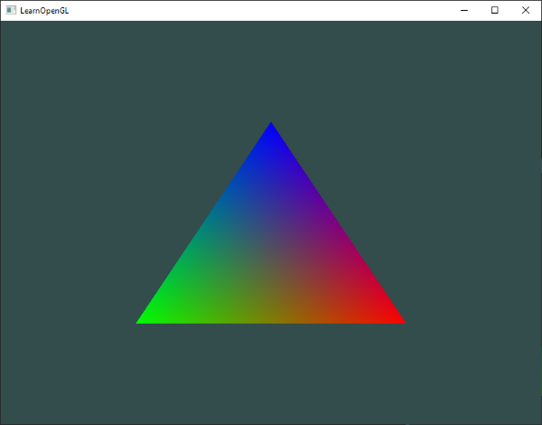

# Shaders

**Shaders** are little programs that run for each GPU kernal. Each shader runs for a specific section of the graphics pipeline. At their core, they are nothing more than programs transforming inputs to outputs. They are also isloated, as they are running in parallel on a ton of gpu cores. The only communication they have is via their inputs and outputs. 

# GLSL

Shaders in OpenGl are written in C-like GLSL. They begin with a version delcaration, followed by inputs and outputs, then uniforms, then a main function. 

```cpp
#version version_number
in type in_variable_name;
in type in_variable_name;

out type out_variable_name;
  
uniform type uniform_name;
  
void main()
{
  // process input(s) and do some weird graphics stuff
  ...
  // output processed stuff to output variable
  out_variable_name = weird_stuff_we_processed;
}
```

In the vertex shader each input is a **vertex attribute**. On all hardware there are always at least 16 4-component vertex attributes available. 

```
int nrAttributes;
glGetIntegerv(GL_MAX_VERTEX_ATTRIBS, &nrAttributes);
std::cout << "Maximum nr of vertex attributes supported: " << nrAttributes << std::endl;
```

Mine supports 16. 

GLSL has fundamental data types (int, float, double, uint, and bool), and two container types : vectors and matrices. 

### Vectors

A vector is a 1-4 component container for any of the fundamental data types. These are the types of vectors

* **vecn** vector of n float
* **bvecn** vector of n booleans
* **ivecn** vector of n ints
* **uvecn** vector of n unsigned integers
* **dvecn** vector of n double components

Components can be accessed via vec.x - vec.w for each element. You can also use rgba, or stpq for textures. You can swizzle vectors like so

```GLSL
vec2 someVec;
vec4 differentVec = someVec.xyxx;
vec3 anotherVec = differentVec.zyw;
vec4 otherVec = someVec.xxxx + anotherVec.yxzy;
```

Any combination of up to 4 letters can be used to create a new vector of the same type. You can also pass vectors into constructor for other vectors

```GLSL
vec2 vect = vec2(0.5, 0.7);
vec4 result = vec4(vect, 0.0, 0.0);
vec4 otherResult = vec4(result.xyz, 1.0);
```

Without inputs a vertex shader is pretty ineffective. To determine where the inputs are we use the layout (location = 0), so we can link it with vertex data. 

!!! note
    You can also use glGetAttribLocation( shaderProgram, "position" ) to figure out where to start, but for basic examples it's simpler to sue the location and it's faster too

The fragment shader needs to output FragColor, otherwise your geometry will be either black or white. If we want to send data from one shader to another, we need to send it through the pipeline. 

#### Vertex Shader

```GLSL
#version 330 core
layout (location = 0) in vec3 aPos; // the position variable has attribute position 0

out vec4 vertexColor; // specify a color output to the fragment shader

void main()
{
    gl_Position = vec4(aPos, 1.0); // see how we directly give a vec3 to vec4's constructor
    vertexColor = vec4(0.5, 0.0, 0.0, 1.0); // set the output variable to a dark-red color
}
```

#### Fragment shader

```GLSL
#version 330 core
out vec4 FragColor;
  
in vec4 vertexColor; // the input variable from the vertex shader (same name and same type)  

void main()
{
    FragColor = vertexColor;
} 
```

The attributes are automatically linked based on the name ( vetexColor ). 

### Uniforms

**Uniforms** are also a way to pass data from our application to the GPU. They differ from vertex attributes in that they are **global** - they are unique pershader program object and can be accessed during any stage in the shader program. 

Because these can be accessed and set anywhere in the program, we have no need to pass it in through the vertex shader, and can define it right in the fragment shader. 

```GLSL
uniform vec4 ourColor
```

!!! warning
    The compilier will silently remove uniform variables that are not begin used

!!! note
    Before assigning and using a uniform you will have to have "used" the program at least once so that a location is assigned. 

### More Attributes!

Let's pump a few more vertex attributes through the pipeline! Because we only have one vertex buffer object we need to plug in the attributes after each other. 


```cpp
// The last parameter sets the offset of where the data begins in the buffer
// Now we are using every 6th float
glVertexAttribPointer(0, 3, GL_FLOAT, GL_FALSE, 6 * sizeof(float), (void*)0);
```

When running the program with this new shader, we see a lot more than three colors



This is because of **fragment interpolation** - the rasterizer does this automatically based on the input positions and colors of vertices. All the input variables of the fragment shader are **interpoloated** by default. 

