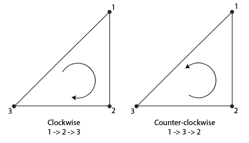

# Face culling

If you are rendering a cube from any angle, the maximum amount of faces you will see is never going to be more than 3. Why are we wasting the effort of drawing those other 3 faces when we can't even see them? You can save *more* than 50% of fragment shader runs because sometimes you see even less than 3 sides. 

This is what **face culling** does. OpenGL checks all the faces that are **front facing** and renders those while discarding all faces that are **back facing**. It figures out which faces are front facing based on the **winding order** of the vertex data. 



The above triangle would translate like this into vertex data

```cpp
float vertices[] = {
    // clockwise
    vertices[0], // vertex 1
    vertices[1], // vertex 2
    vertices[2], // vertex 3
    // counter-clockwise
    vertices[0], // vertex 1
    vertices[2], // vertex 3
    vertices[1]  // vertex 2  
};
```

Ever set of vertices that form a triangle implicitly contain a winding order. If the triangle is facing you, by default, the order is assumed to be counter-clockwise. 


## Implementation

Note that this only makes sense for closed shapes like cubes.

```cpp
glEnable(GL_CULL_FACE);
// decide which frace to cull
// options are GL_FRONT, GL_FRONT_AND_BACK
glCullFace(GL_FRONT);
// you can change the rotation
// the other way is GL_CCW
glFrontFace(GL_CW); 
```


