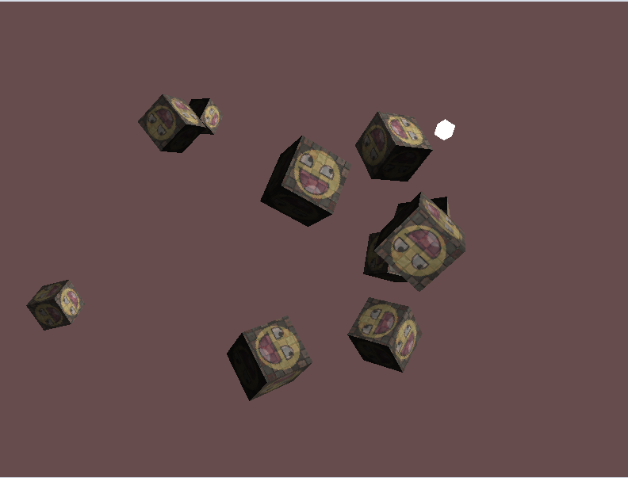
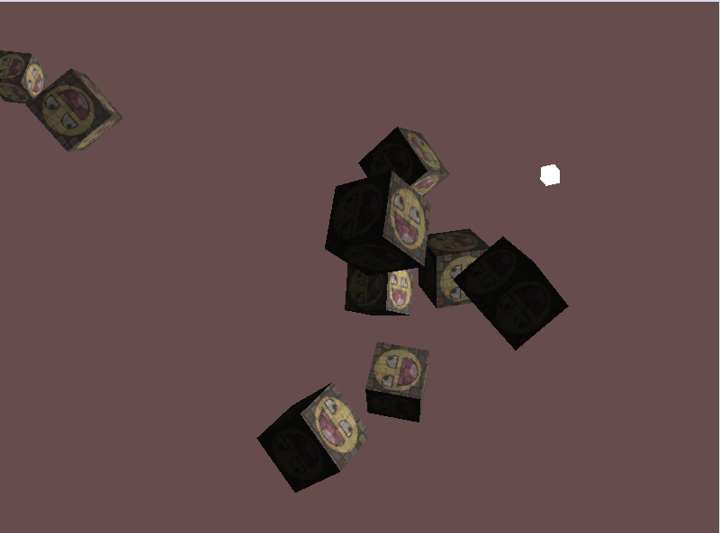

# Basic Lighting

Lighting in OpenGL is based on approximations of reality using simplified models. One of these models is the **Phone lighting model**. There are three components:


* **Ambient lighting** is the base light. 
* **Diffuse lighting** multiplies the object color. This calculates the sides that face the light and makes them brighter.
* **Specular lightin** simulates the highlight. This takes the light color of the light source. 

To create good looking scenes we need to simulate at least these 3 lighting components.

## Ambient Lighting

Nowadays this is often replacewd by a **global illumination** algorithm, but we are going to start with super basic ambient lighting. This is done by adding a small constant (light) color to the final resulting color of the object's fragments. 

## Diffuse lighting

This will start giving significant visual impact to the object. To calculate diffuse lighting, we will need a *normal vector *for the surface of the fragment. 

## Diffuse lighting

This will start giving significant visual impact to the object. To calculate diffuse lighting, we will need a **normal vector** for the surface of the fragment. Remember that we need to update the normal vector by the **transformation** of the shader. We will need to compare the transformed normal with the angel to the light, and the dot product of the two will tell us the intensity.

## Normal vectors

A normal needs to be added to the vertices in order to get the normal vector (remember that OpenGL interpolates all the attributes to the fragments). To calculate the normal we need to add it to our pipeline. 
Then we also need to add the position of the fragment in world coordinates. 
In the vertex shader

```GLSL
FragPos = vec3(model * vec4(aPos, 1.0));
```

You need this to calculate the vector to the light position in the fragment shader. This will be interpolated to a per-fragment world position. First we generate the vectors to compare and normalize them just to be safe 

```GLSL
vec3 normalizedN = normalize(N);
vec3 lightDir = normalize(lightPos - FragPos);

// then calculate the diffuse through the dot product
// note we don't care about values more then 180 degeres away from the light so we are using max to discard results of the dot product under 0
float diffuse = max(dot(normalizedN, lightDit), 0.0);
vec3 diffuse = diff * lightColor;
```

The result looks good, but the normals don't seem right. 



This is because you can't just transform the normal vector by the model matrix. Normal vectors don't have a position attribute, they are only direction. So first off we should remove the translation part of the matrix. The model matrix could perform a non-uniform scale, which changes the vertices in such a way that the normal vector is no longer perpendicular with the surface anymore. 

Whenever there is a non-uniform scale applied to a vector, even if it gets normalized afterwards, it will end up scewed and not perpendicular to the surface anymore. The solution is using a model matrix specifically tailored to for normal vector, a **normal matrix**. This uses the steps in [this article](http://www.lighthouse3d.com/tutorials/glsl-12-tutorial/the-normal-matrix/) to generate a matrix to transform the normals. 

Basically the normal matrix is the *transpose of the inverse of the upper-left 3x3 part of the model matrix*. Usually you would derive the normal from the model and view matrix, but because we are working in world space we will derive it from the model matrix alone. 

```GLSL
N = mat3(transpose(inverse(model)))*aN;
```

Now the normals are fixed 



!!! NOTE
    Inversing matrices is an expensive operation for a shader, so whenever possible try to avoid doing inverse operations. They need to be done for eac hvertex in the scene. In a *real* application you would want to pre-calculate this matrix and then pass it in as a uniform. 

```cpp
glm::mat3 normalMatrix{glm::mat3(glm::transpose(glm::inverse(model)))};
geometryShader.setMatrix3("normalMatrix", normalMatrix);
```

## Specular Lighting

Specular is similar the diffuse, but based on the player direction. 


Basically you figure out the reflection vector by mirroring the light direction around the norm axis and seeing if it's in the range of the light. This means we need to get the view vector. For this tutorial we will need to input the world space as another uniform, but many people like to calculate the spec and diffuse in view space. This is convenient, because view space always has (0,0,0) as the view position so you safe a uniform. 

```GLSL
//specular
vec3 viewDir = normalize(viewPos - FragPos);
// negate the light dir to match the reflect function.
vec3 reflectDir = reflect(-lightDir, normalizedN);
// calculate the dot produce between view direction and reflect direction
// raise it to the pow of 32 (higher is sharper spec)
float spec = pow(max(dot(viewDir, reflectDir), 0.0), 32);

vec3 result = (ambient + diffuse + specular) * objectColor;
```

The **shinyness** of the shader is created by raising the dot product to a pow. 


!!! Note
    Back when frag shaders were super expensive, ppl would calculate the same lighting model (called Gouraud) on the vertex shader and let OpenGl handle the interpolation. This looks kinda shit though because it's not accounting for all the highlights between the vertices. 


