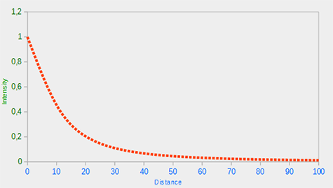

# Light Casters

There are many different types of **light casters** in the real world. 

## Directional Light


When a light source is modeled to be *infinitely* far away it is a **directional light**. The sun (from our perspective) is a great model for a directional light. Relative to the earth all the light rays are nearly parallel. 

This is a very simple implementation. 

!!! Passing position as vec4
    You can also pass position data (like the lights direction or position) as a vec4 to better match openGl's structure. Just make sure you always set the 4th element to 1.0, unless it's a direction vector in which case it's 0.0. This will make it easy to check if the light's vector is position or direction. This is how old scool OpenGl (fixed pipe) used to do things. 


## Point Light


A **point light** has a given position in the world and illimunates in all directions with rays fading out over distance. **Attenuation** is the process of recuding the intensity of the light over the distance a light ray travels. The most basic way to implement this is using a linear equation. These tend to look a bit fake. The brightness of a light in the real world tends to fall off very quickly, leaving a fraction that then diminishes over a larger distance. 

To get the attenuation we use the following formula

$$
F_{ att  }= \frac{
    1.0
}{
    K_x + K_l * d + K_q * d^2
}
$$

* d = distance from fragment to light source
* $K_c$ is a constant term kept at 1.0, which is there to make sure the denominator never gets smaller than 1. If it was smaller than one that would boost the intensity with certain distances.
* $K_l$ is a linear term multiplied with the distance value that creates a linear reduction
* $K_q$ is a quadratic term multiplied with the quadrang of the distance and it sets a quadratic decrease of intensity from the light source. This is less significant when the distance is small, but makes a larger difference as the distance increases. 
    


You can get good default values for lights from [Ogre 3d's wiki](http://wiki.ogre3d.org/tiki-index.php?page=-Point+Light+Attenuation)

| Distance | Constant | Linear | Quadratic | 
| -- | -- | -- | -- |
| 7 | 1.0 | 0.7 | 1.8 |
| 50 | 1.0 | 0.09 | 0.032 | 
| 100 | 1.0 | 0.045 | 0.0075 |
| 200 | 1.0 | 0.022 | 0.0019 | 

To implement a point light I'm going to subclass my light class and add additional position, constant, linear, and quadratic properties. 

Point light is a light source with a configurable location and attenuation applied to it's lighting calculations. 

## Spotlight

The **spotlight** is like a pointlight, but it has a limited direction towards which is shoots rays. The direction is limited by a **cutoff** andle that specifies the radius of the spotlight. 


* Lightdir: the vector pointing from the fragment to the light source
* Spotdir: the direction the spotlight is aiming at
* Phi $\phi$ the cutoff angle of the spotlight's radius. Everything outside this is not lit
* Theta $\theta$ the angle between the Light Dir and the Spotdir vector. This should be smaller then $\phi$ to be considered lit and in the spotlight. 

So once again we need the dot product for the cosine of the angle between the lightDir and the SpotDir. Then compare that with the cutoff angle $\phi$ to get the strength of the light's effect.

## Flashlight

A **flashlight** is a spotlight located at the viewer's position and usually aimed straight ahead in the direction the player is facing. 

## Smooth/Soft Edges

For smoothing around the edges of the spotlight, we want to simulate the spotlight having an inner and outer cone. The inner cone can be the cutoff value, with the outer cone being a smoothstep to that value. Then if the fragment is between the inner and the outer cone it should calculate an intensity value between 0.0 and 1.0. If the fragment is inside the inner cone its intensit yis equal to 1.0 and 0.0 if the fragment is outsid the outer cone. 

To get the value we can use the following equation:

$$
I = \frac{
    \theta - \gamma
}{
    \epsilon
}
$$

$\epsilon$ is the cosine difference between the inner ($\phi$) and outer ($\gamma$) cone. $\epsilon = \phi - \gamma$.
"I" is the intensity of the spotlight at the current fragment. 
This translates into glsl like the following

```GLSL
float theta     = dot(lightDir, normalize(-light.direction));
float epsilon   = light.cutOff - light.outerCutOff;
// the clamping is for convenience so we don't need an if in the frag shader
float intensity = clamp((theta - light.outerCutOff) / epsilon, 0.0, 1.0);    
```


