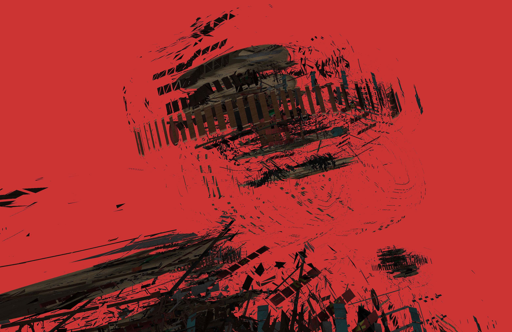

# Geometry Shader

There is another optional shader which executes between the vertex and fragment shader called the **geometry shader**. This takes as input a set of vertices that form a primitive, and can then transform and add geometry. 

This is a geometry shader


```GLSL
#version 330 core
layout (points) in;
layout (line_strip, max_vertices = 2) out;

void main() {    
    gl_Position = gl_in[0].gl_Position + vec4(-0.1, 0.0, 0.0, 0.0); 
    EmitVertex();

    gl_Position = gl_in[0].gl_Position + vec4( 0.1, 0.0, 0.0, 0.0);
    EmitVertex();
    
    EndPrimitive();
}  
```

The **in** keyword is required to determine what kind of geometry is coming into the shader. Almost all geometry types are supported. We also need to specify a primitive type that the geometry shader will output. This is done by the second layout specifier in the example above. Unlike the input specifier that can take in almost any geometry supported by gl, the output layout qualifier only support three primitive values.

* points
* line_strip
* triangle_strip

Triangles would take the triangle_strip, lines the line_strip, and points the points. 

This shader also expects us to set a maximum number of vertices it outputs. 

To get data into the geometry shader, you use the gl_in struct which OpenGL provides. 

!!! Note
    gl_in is declared as an array struct. It has all of the vertices in the primitive. 

You create new vertices with EmitVertex(), and end your new primitives with EndPrimitive().


A **triangle strip** in OpenGL is a more efficient way to draw triangles with fewer vertices. After the first triangle, each subsequent vertex will add a new triangle. 


With this in mind we can create house shapes out of our points with the following geometry shader

```GLSL
#version 330 core
layout (points) in;
layout (triangle_strip, max_vertices = 5) out;

void build_house(vec4 position)
{    
    gl_Position = position + vec4(-0.2, -0.2, 0.0, 0.0);    // 1:bottom-left
    EmitVertex();   
    gl_Position = position + vec4( 0.2, -0.2, 0.0, 0.0);    // 2:bottom-right
    EmitVertex();
    gl_Position = position + vec4(-0.2,  0.2, 0.0, 0.0);    // 3:top-left
    EmitVertex();
    gl_Position = position + vec4( 0.2,  0.2, 0.0, 0.0);    // 4:top-right
    EmitVertex();
    gl_Position = position + vec4( 0.0,  0.4, 0.0, 0.0);    // 5:top
    EmitVertex();
    EndPrimitive();
}

void main() {    
    build_house(gl_in[0].gl_Position);
}  
```

If you want to assign more vertex attributes to the newly created vertices, simply bind the output variables before creating the vertices.

```GLSL
fColor = gs_in[0].color;
gl_Position = position + vec4();
EmitVertex(); // this takes te currently bound position and color
```

## Exploding objects

You can explode all the faces of an object you want to draw by transforming them in the object shader. This is similar to inflating an object in the vertex shader, but the render primitives aren't connected.

Note that you only have access to three vertices in the geometry shader that make up the render primitive (line, triangle etc)

This is the exploded artwork I came up with



## Normals

