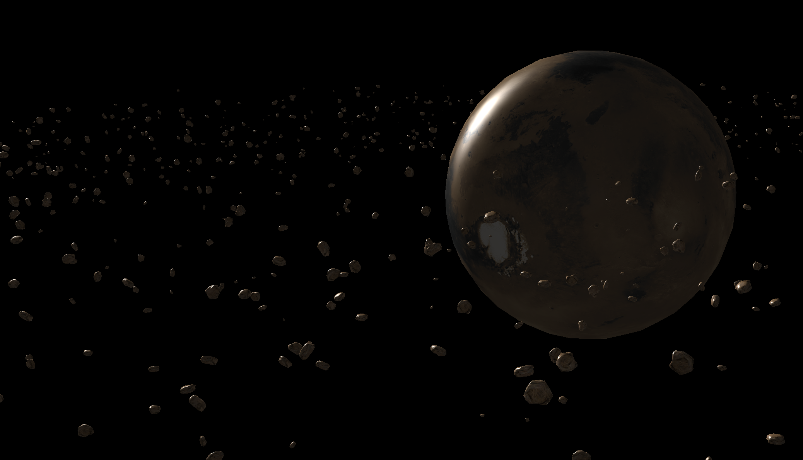
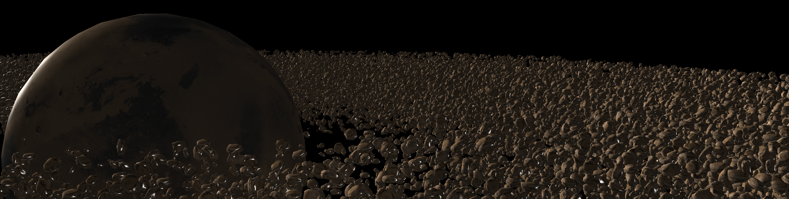

# Instancing

If you are drawing literally thousands of the same object every frame, that many render calls will drastically reduce performance. Compared to rendering the actual vertices, the glDrawArrays and glDrawElements are pretty expensive because of the preperations they need to make. 

Instancing allows the same object multiple times using a single draw call. This saves us all the CPU -> GPU communications needed each time we need to render an object. To use this we just need to change our draw call from glDrawArrays and glDrawElements to glDrawArraysInstance and glDrawElementsInstanced. These functions take one extra parameter, which is the **instnace count**. When using shaders with these functions there is one new build-in variable in the vertex shader called **gl_InstanceID**. You change the position in the vertex shader by indexing a bound position based on the gl_InstanceID

```GLSL
#version 330 core
layout (location = 0) in vec2 aPos;
layout (location = 1) in vec3 aColor;

out vec3 fColor;

uniform vec2 offsets[100];

void main()
{
    vec2 offset = offsets[gl_InstanceID];
    gl_Position = vec4(aPos + offset, 0.0, 1.0);
    fColor = aColor;
}
```

Usigne a uniform array isn't very optimial though, not only because of the fixed amount of object hardcoded into the shader, but also just because of the fairly low memory limit for uniforms. 
It's much better to intput the data through another buffer which is known as an **instanced array**. 

```GLSL
#version 330 core
layout (location = 0) in vec2 aPos;
layout (location = 1) in vec3 aColor;
layout (location = 2) in vec2 aOffset;

out vec3 fColor;

void main()
{
    gl_Position = vec4(aPos + aOffset, 0.0, 1.0);
    fColor = aColor;
}  
```

For this instance buffer it's going to have a different size to our object buffer. So we create a new VBO, but tell it to update on every second instance call. This is done with a funky function called glVertexAttribDivisor, which tells openGL when to step through the array. At 0 open gl will step by every vertex, but at 1 or above it will step through ever x instance. 

```cpp
glEnableVertexAttribArray(2);
glBindBuffer(GL_ARRAY_BUFFER, instanceVBO);
glVertexAttribPointer(2, 2, GL_FLOAT, GL_FALSE, 2 * sizeof(float), (void*)0);
glBindBuffer(GL_ARRAY_BUFFER, 0);	
glVertexAttribDivisor(2, 1);  
```

In the vertex shader we bind it like any other buffer

```GLSL
layout (location = 0) in vec2 aPos;
layout (location = 1) in vec3 aColor;
layout (location = 2) in vec2 aOffset;
```

Now we will try instancing on a more complex scene. This scene has a bunch of asteroids. I start getting a low fps after increasing the amount to about 6000



We will rewrite the code so that there is not a draw call per asteroid. This time it's a bit more complicated, because we want to bring over the whole mat4 thruogh the buffer. The maximum amount of data in a buffer attrib is equal to a vec4. A mat4 is 4 vec4s so we need to reserve 4 vertex attributes for this matrix. 

With instancing we can draw 80000 before running into framerate issues (probably because of other unoptimzied stuff)




